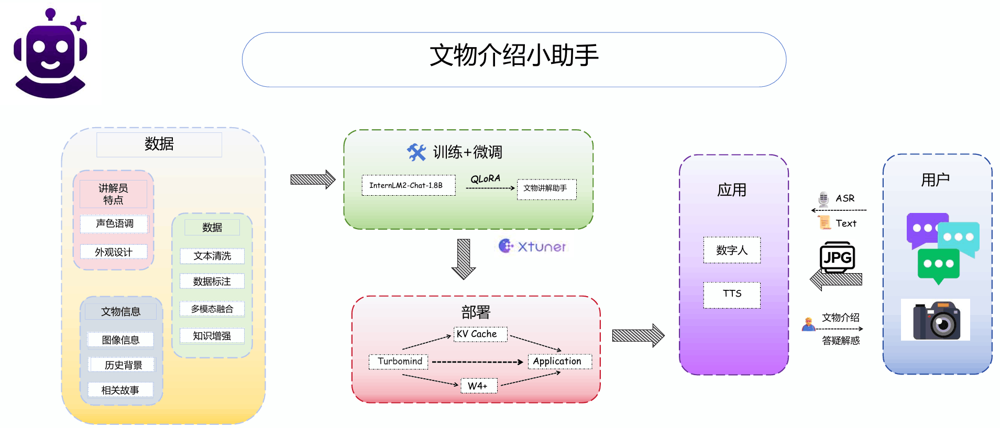

# 项目简介 🎨

**Cultural_relics_explan** 文物讲解助手是一个基于 InternLM 书生浦语大模型开发的智能应用，旨在为博物馆和文物展览提供自动化的文物讲解服务。通过先进的自然语言处理技术，该助手能够理解用户的查询并提供详细的文物信息，增强观众的参观体验。

---

## 🌟 特点

- **语音交互功能** 🎙️  
  - 语音输入 🎤  
  - 语音输出 🔊  
- **数字人展示** 🧑‍💻  
- **实时信息反馈** ⏱️  
- **历史与文化信息整合** 📜  

---

## 使用场景 🏛️

1. **博物馆导览**：为博物馆提供自动化的文物讲解服务。  
2. **教育工具**：作为教育工具，帮助学生了解和学习历史文化。  
3. **旅游辅助**：为游客提供文物背景信息，增强旅游体验。  

---

## 🙏 特别鸣谢

**https://github.com/PeterH0323/Streamer-Sales**

---
